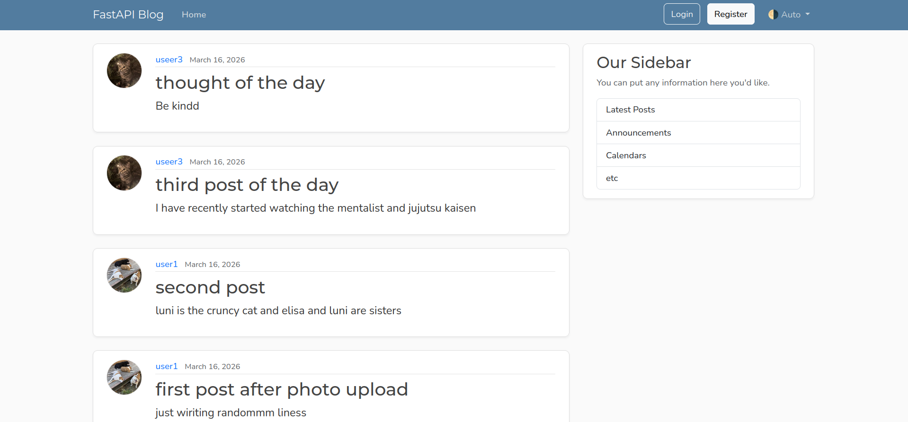
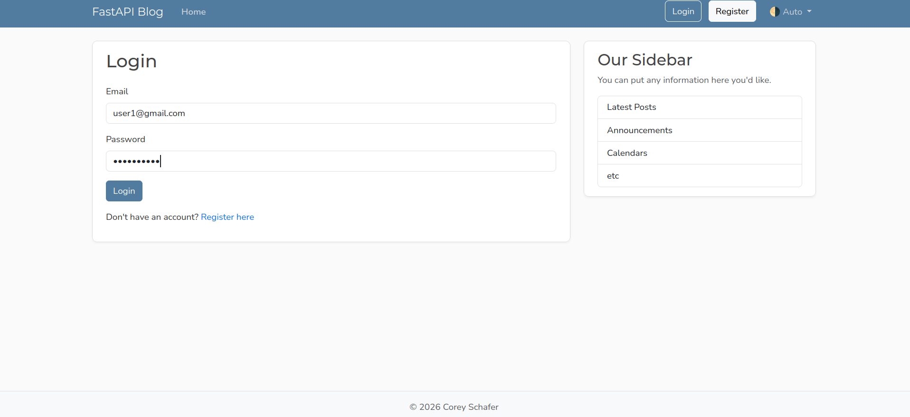
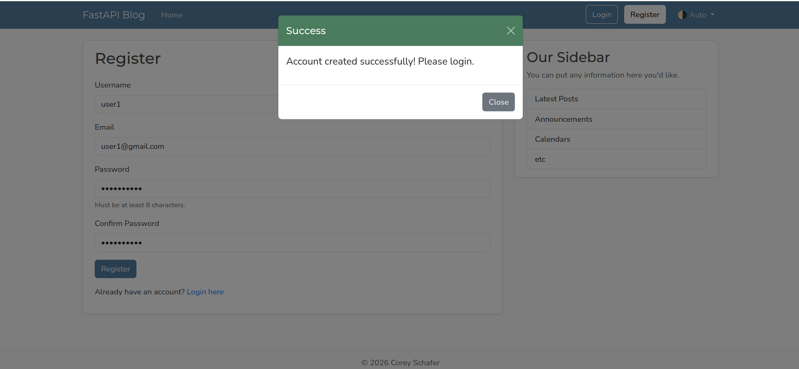
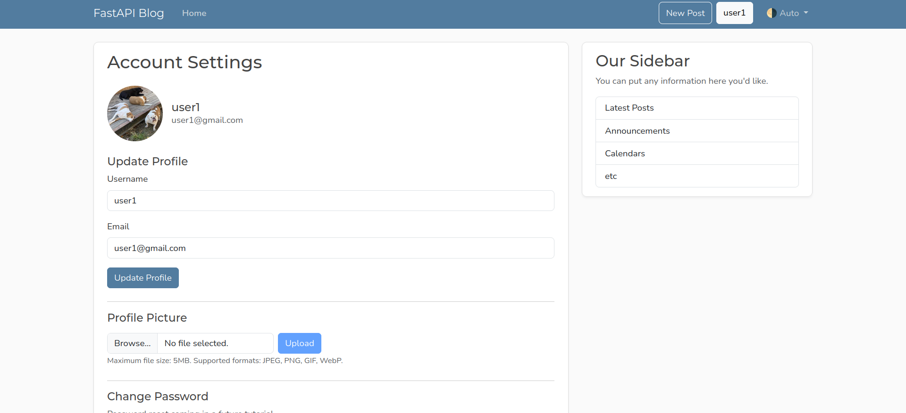
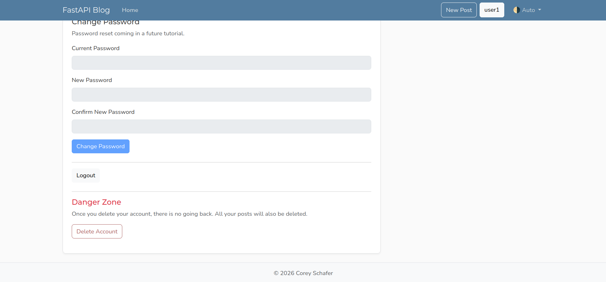
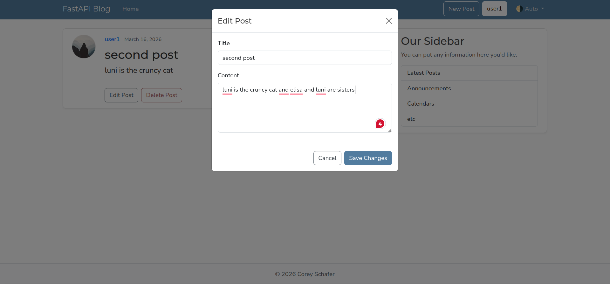
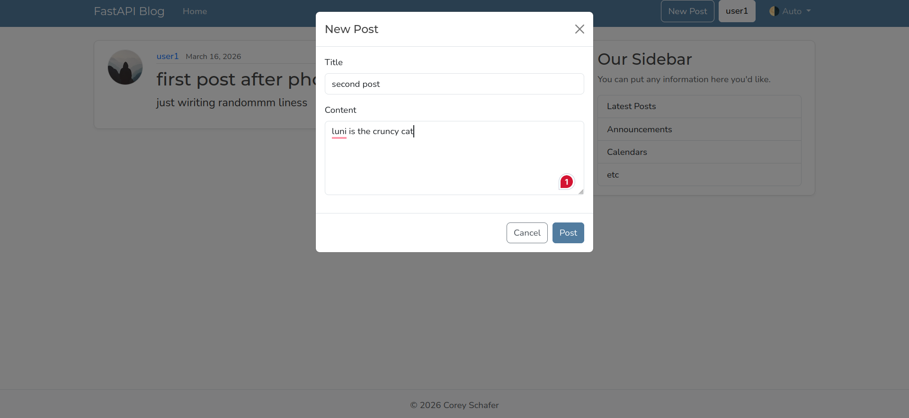

This project is based on a tutorial I am learning from. The images of the project can be found in photos application folder.
Backend is made using fastapi and frontend using html, Jinja2 templates. The blog site contains registration and login feature (authentication and authorisation) , a home page, account information and the ability to delete account or change profile details like picture

